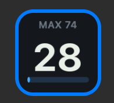

# Combo Counter for Stream Deck



打鍵とクリックを数えて、**途切れずに続いた回数**を Stream Deck のキーに出します。
3秒手が止まると `BREAK` と出て 0 に落ちます。

- 上段が自己記録。更新中は色が変わります
- 下のバーは切れるまでの残り時間
- 10 / 25 / 50 / 100 / 200 / 400 を越えると輪が広がり、色が変わります
- 押すと表示が切り替わります（コンボ → 最高 → 今日の総数 → 毎分の操作数）

<br clear="right">

## 数えるもの

**件数だけを数えます。どのキーが押されたかは読み取りません。**

入力を拾うヘルパが親プロセスに渡すのは `k`（キー押下）と `m`（マウス押下）の1文字だけです。
キーコードも、入力された文字も、前面アプリの名前も扱いません。
記録は端末内にのみ保存し、ネットワークには一切つなぎません。

ヘルパの実装は [`src/tap-counter.swift`](src/tap-counter.swift)（macOS）と
[`bin/tap-counter.ps1`](com.kanade0525.combocounter.sdPlugin/bin/tap-counter.ps1)（Windows）で、
どちらも数十行です。

数えないもの:

- スクロール（トラックパッドの慣性で毎秒何十件も飛ぶため）
- 修飾キー単体（Shift・Control・Option など）
- 押しっぱなしの自動リピート（Windows 版のみ。macOS では数えます）

## 要るもの

- macOS 12 以降
- Stream Deck 6.9 以降（ボタンのみの機種で動きます）
- 入力監視の許可
- Xcode Command Line Tools（ビルドに使います。無料）

### Windows について

**Windows 版のヘルパは書いてありますが、実機で検証していないので、
プラグインの対応OSからは外してあります。** 動かしてみたい方は
[`bin/tap-counter.ps1`](com.kanade0525.combocounter.sdPlugin/bin/tap-counter.ps1)
と manifest の `OS` に windows を足せば試せます。動いた・動かないの報告は
Issue で歓迎します。

## 入れる

```sh
git clone https://github.com/kanade0525/streamdeck-combo-counter.git
cd streamdeck-combo-counter
npm run build
npm run link
```

Stream Deck を再起動し、**Combo Counter > コンボカウンタ** をキーに置きます。
初回は入力監視の許可を求められるので、許可してからもう一度 Stream Deck を再起動してください。
キーに鍵の絵が出ているときは、そのキーを押すと設定画面が開きます。

[Releases](https://github.com/kanade0525/streamdeck-combo-counter/releases) の
`.streamDeckPlugin` からも入れられますが、署名していないため macOS では Gatekeeper に止められます。
上のビルド手順なら隔離属性が付かないのでそのまま動きます。

## 仕組み

```
ヘルパ（常駐）  macOS   Swift + CGEventTap（listenOnly）
                Windows PowerShell + GetAsyncKeyState
      ↓ stdout（k / m の1文字）
plugin.js      集計・コンボ判定・SVG描画・記録
      ↓ WebSocket
Stream Deck
```

キーの絵は SVG を `setImage` に直接渡しています。ビルドステップはありません。

Windows 側がフックではなく走査なのは、受け取る側にコンパイラを要求せず、
ウイルス対策の誤検知も避けるためです。

## 描画レート

キーの絵の更新は**毎秒10回まで**です。Stream Deck のプラグインガイドラインの規定で、
送信そのものに関門を置いて機械的に守らせています。

打鍵は毎秒10回を軽く超えるので、絵を打鍵のたびに送ることはできません。
かといって間引くと最後の1打が画面に出ないまま止まります。そこで送れない間の要求は
捨てずに**最新の1件だけ**を覚えておき、間隔が空いた時点で送っています。
だから速く打っても、打ち終わりの数字は必ず出ます。

演出をコマ送り（輪は4コマ、切れは3段階）にしてあるのも同じ理由です。
100ms 刻みで滑らかに見せようとすると、かえって中途半端になります。

なお Stream Deck アプリの CPU は送信レートにほぼ比例し（実測）、10fps なら約2%です。
測定の詳細は [MEASUREMENTS.md](MEASUREMENTS.md)。

## 開発

```sh
npm test        # 検査（依存パッケージ不要）
npm run build   # ヘルパを組み直す（macOS）
npm run link    # 開発中のものを Stream Deck に見せる
npm run pack    # .streamDeckPlugin を作る
```

配布物は `v0.1.0` の形のタグを押すと GitHub Actions が組み立てて Release に添えます。

```
com.kanade0525.combocounter.sdPlugin/
  bin/combo-state.js    コンボの状態機械（検査の対象）
  bin/draw.js           SVG の組み立て
  bin/rate-limit.js     送信の関門（毎秒10回の上限を守らせる）
  bin/input-source.js   ヘルパの起動と監視
  bin/plugin.js         Stream Deck との接続
  bin/tap-counter.ps1   入力を数えるヘルパ（Windows）
src/tap-counter.swift   入力を数えるヘルパ（macOS）
tests/
```

## 既知の制約

- Windows 版は実機で検証していないため、対応OSから外しています
- macOS で Secure Input が有効な間（パスワード欄など）は打鍵を拾えません
- 署名していないので、ビルド済みのものを配ると Gatekeeper に止められます

## ライセンス

MIT
